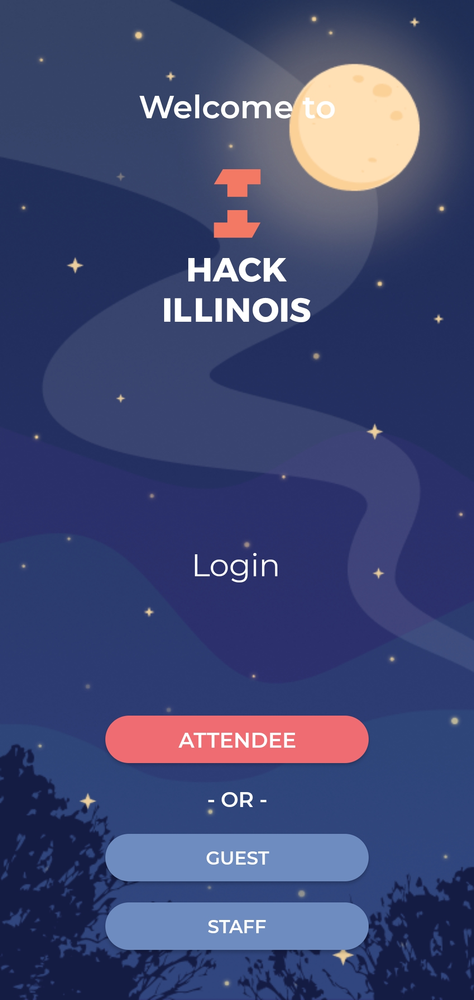
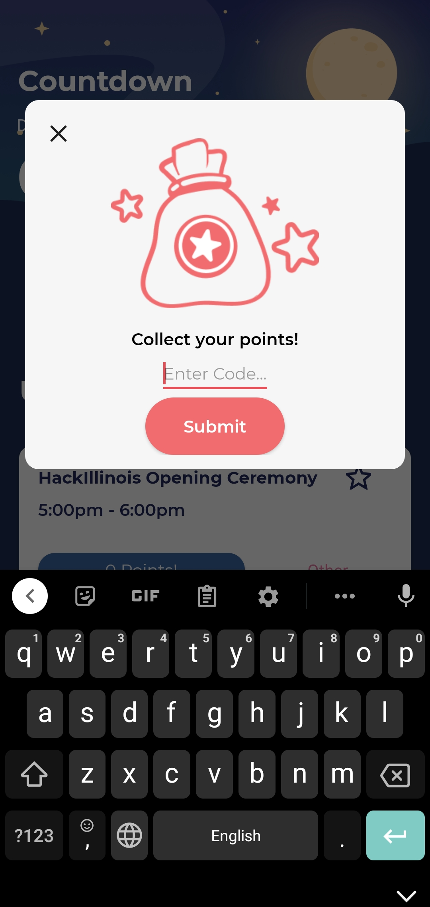
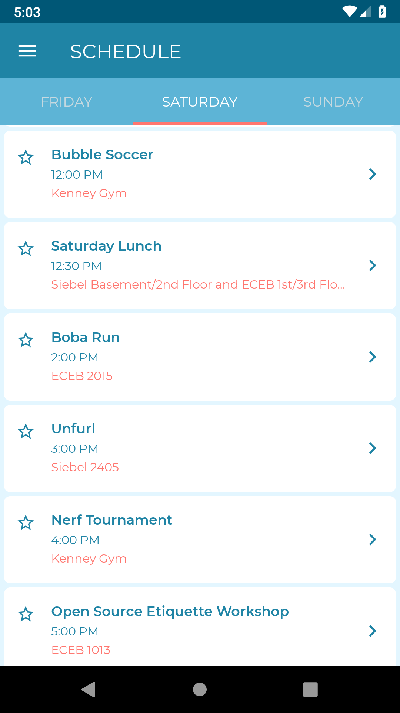
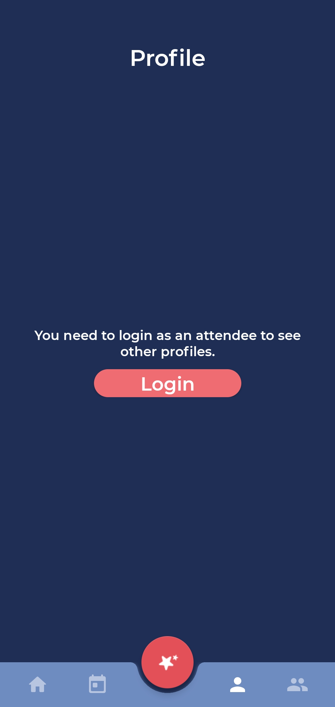
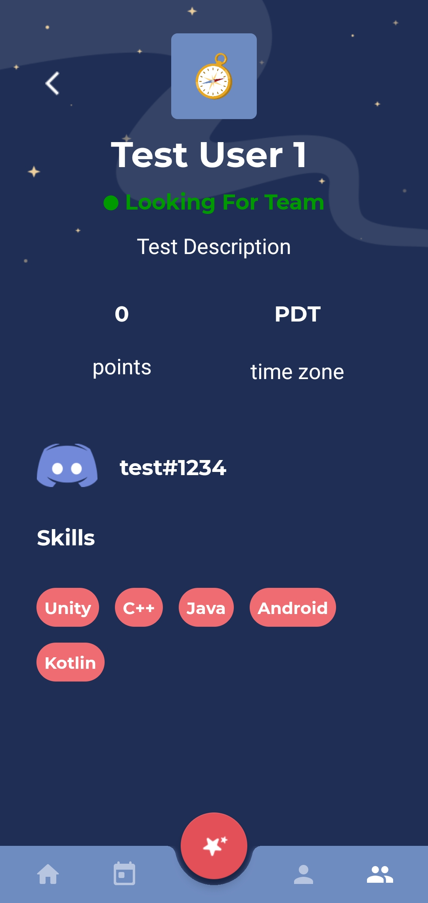
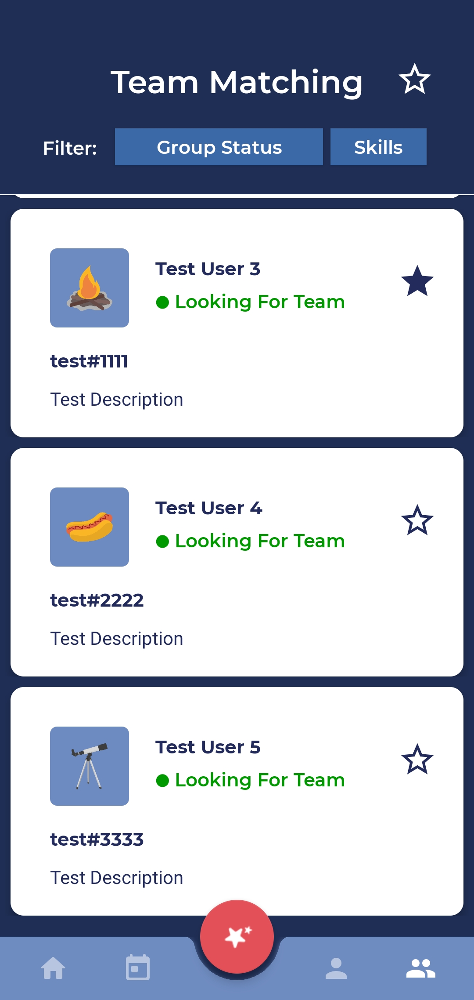

# The Official HackIllinois Android App
[](https://github.com/HackIllinois/android/actions)

   

[](https://play.google.com/store/apps/details?id=org.hackillinois.android.release)

## Development Setup
1. Download and install [Android Studio](https://developer.android.com/studio).
2. Download and install [Git](https://git-scm.com/downloads). 
3. Clone this repository: `git clone https://github.com/HackIllinois/android.git`
4. Open this project in Android Studio:
    a. Open Android Studio.
    b. Click "Open an existing Android Studio project"
    c. Select the "android" folder in the location that you cloned to.
5. Create a `~/.gradle/gradle.properties` file at the root of your machine.
    a. If on Windows, this will be `C:\Users\username\.gradle\gradle.properties`
6. Fill this follow with the following content:
    ```
    GOOGLE_MAPS_API_KEY=<API_KEY_HERE>
    ```
    a. You can either create your own Google Maps API Key, or contact one of the developers for our development key.
7. In the cloned project, create an `app/google-services.json` file. You can get a copy of this file from one of the developers.
