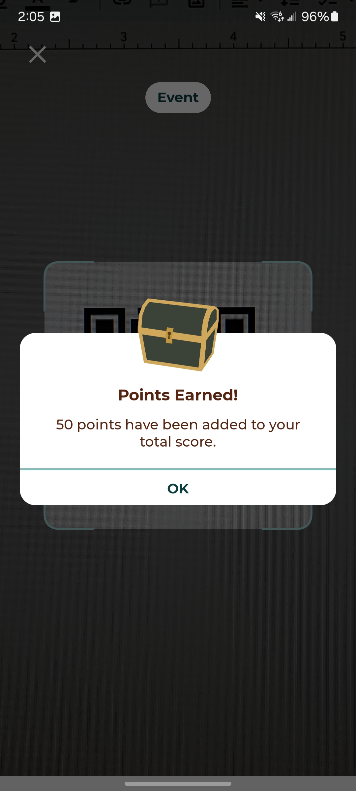

# The Official HackIllinois Android App
[](https://github.com/HackIllinois/android/actions)

    

   

[](https://play.google.com/store/apps/details?id=org.hackillinois.android.release)

## Development Setup
* Download and install [Android Studio](https://developer.android.com/studio)
* Download and install [Git](https://git-scm.com/downloads) and [GitHub Desktop](https://desktop.github.com/) (optional)

## Installation
1. Clone the repository.

   `git clone https://github.com/HackIllinois/android.git`

2. Open the project in Android Studio.
     - Open Android Studio
     - Click "Open an existing Android Studio project"
     - Select the `android` folder in the location that you cloned to

3. On your computer, create a `~/.gradle/gradle.properties` file in the generated `.gradle` folder.
     - If on Windows, this will be `C:\Users\username\.gradle\gradle.properties`

4. Fill this `gradle.properties` file with the following text:
    ```
    GOOGLE_MAPS_API_KEY=<API_KEY_HERE>
    ```
     - The `<API_KEY_HERE>` should be replaced with the Google Maps API Key. You you can use your own key or contact one of the developers for our development key.

5. Back in the cloned project in Android Studio, create an `app/google-services.json` file.
     - You can get a copy of this file from one of the developers

**Note: steps 3 & 4 are only necessary if the app uses the Google Maps API for the schedule event cards (current 2024 version doesn't)**
